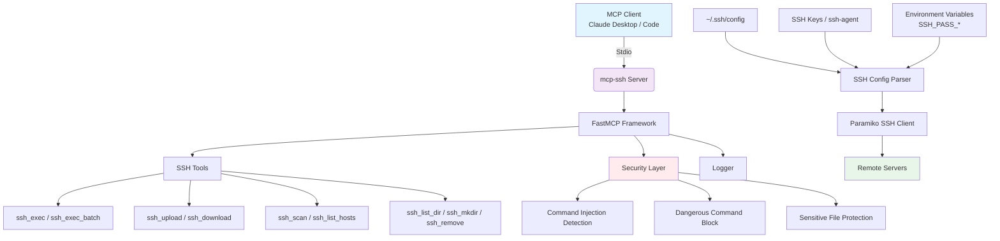

# mcp-ssh

<div align="center">

**轻量级跨平台 SSH MCP 服务器**

[](https://www.python.org/)
[](https://www.gnu.org/licenses/gpl-3.0)
[](https://modelcontextprotocol.io/)

[English](README_EN.md) | [简体中文](README.md)

</div>

复用本地 `~/.ssh/config` 主机配置，密钥优先、密码兜底，自动解决编码乱码、跨平台兼容问题。

---

## 📐 架构图



---

## ✨ 特性

- 🌍 **全平台支持**：Windows/Linux/macOS 自动适配路径、编码、shell 差异
- 🔑 **零配置认证**：自动使用 SSH config 密钥、默认密钥、ssh-agent，密码环境变量兜底
- 🔤 **智能编码**：自动检测 UTF-8/GBK/GB2312/Big5，彻底解决中文乱码
- 🛡️ **安全防护**：内置命令注入检测、高危命令拦截，防止误操作
- 📁 **SFTP 文件传输**：支持文件/目录的上传下载，自动创建父目录
- ⚡ **批量执行**：支持批量执行命令，错误自动中断
- 🩺 **智能诊断**：TCP 预检精准区分网络错误、认证失败、主机离线
- 🔍 **局域网扫描**：快速扫描网段发现在线 SSH 主机

---

## 🚀 快速开始

### 安装

```bash
git clone https://github.com/yourusername/mcp-ssh.git
cd mcp-ssh
uv sync
```

### 配置 SSH 别名

编辑 `~/.ssh/config`：
```ssh-config
Host myserver
    HostName 192.168.1.100
    User ubuntu
    IdentityFile ~/.ssh/id_ed25519
```

### 密码认证（可选）

```bash
# 单主机密码（主机名点/横线转下划线，大写）
export SSH_PASS_MYSERVER="your-password"
# 全局兜底
export SSH_PASS="fallback-password"
```

Windows PowerShell:
```powershell
$env:SSH_PASS_MYSERVER = "your-password"
```

---

## 🔧 MCP 客户端配置

### Claude Code
```bash
claude mcp add ssh -- uv run --directory /path/to/mcp-ssh python server.py
```

### 通用配置
```json
{
  "mcpServers": {
    "ssh": {
      "command": "uv",
      "args": ["run", "--directory", "/path/to/mcp-ssh", "python", "server.py"]
    }
  }
}
```

---

## 📖 工具列表

| 工具 | 说明 |
|------|------|
| **命令执行** | |
| `ssh_exec(host, command, timeout=30, shell=None, allow_dangerous=False)` | 执行远程命令，返回 exit_code/stdout/stderr |
| `ssh_exec_batch(host, commands, timeout=30, stop_on_error=True)` | 批量执行多条命令 |
| **主机管理** | |
| `ssh_list_hosts()` | 列出 ~/.ssh/config 中配置的主机别名 |
| `ssh_scan(network="192.168.1.0/24", port=22, timeout=2.0)` | 扫描局域网在线主机 |
| **文件操作** | |
| `ssh_list_dir(host, remote_path="~")` | 列出远程目录内容 |
| `ssh_stat_file(host, remote_path)` | 获取远程文件详细信息 |
| `ssh_mkdir(host, remote_path, parents=True)` | 创建远程目录 |
| `ssh_remove(host, remote_path, recursive=False)` | 删除远程文件/目录 |
| `ssh_upload(host, local_path, remote_path)` | 上传文件到远程 |
| `ssh_download(host, remote_path, local_path)` | 从远程下载文件 |
| `ssh_upload_dir(host, local_dir, remote_dir)` | 递归上传目录 |
| `ssh_download_dir(host, remote_dir, local_dir)` | 递归下载目录 |

> `host` 支持 SSH config 别名或 `user@hostname` 格式。

---

## 🛡️ 安全

- **注入检测**：拦截命令拼接、反弹 shell、远程脚本执行等特征
- **高危拦截**：默认阻止 `rm -rf /`、`mkfs`、`shutdown` 等危险命令
- **敏感保护**：阻止未授权访问 `/etc/passwd`、SSH 密钥等敏感文件
- 需执行高危操作时显式设置 `allow_dangerous=True`

---

## ⚙️ 环境变量

| 变量 | 默认值 | 说明 |
|------|--------|------|
| `SSH_PASS` | - | 全局兜底密码 |
| `SSH_PASS_<HOST>` | - | 单主机密码 |
| `SSH_LOG_LEVEL` | `INFO` | 日志级别 DEBUG/INFO/WARNING/ERROR |
| `SSH_LOG_FILE` | `~/.ssh/mcp-ssh.log` | 日志文件路径 |

---

## 📁 项目结构

```
mcp-ssh/
├── server.py          # MCP 服务器主程序
├── logger.py          # 结构化日志模块
├── pyproject.toml     # 依赖配置
├── LICENSE            # GPLv3 许可证
├── README.md          # 中文文档
└── README_EN.md       # 英文文档
```

---

## 📄 许可证

本项目采用 [GNU General Public License v3.0](LICENSE) 许可证。
