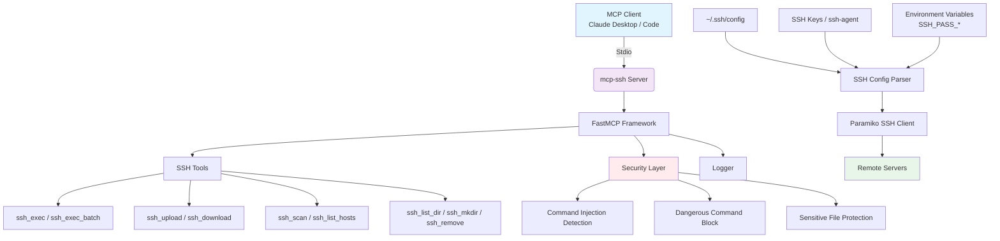

# mcp-ssh

<div align="center">

**Lightweight Cross-Platform SSH MCP Server**

[](https://www.python.org/)
[](https://www.gnu.org/licenses/gpl-3.0)
[](https://modelcontextprotocol.io/)

[English](README_EN.md) | [简体中文](README.md)

</div>

Reuses local `~/.ssh/config` host configurations, key-based authentication first with password fallback, automatically resolves encoding issues and cross-platform compatibility.

---

## 📐 Architecture



---

## ✨ Features

- 🌍 **Cross-Platform**: Windows/Linux/macOS automatic path, encoding, and shell adaptation
- 🔑 **Zero-Config Auth**: Automatically uses SSH config keys, default keys, ssh-agent, with password env var fallback
- 🔤 **Smart Encoding**: Auto-detects UTF-8/GBK/GB2312/Big5, eliminates Chinese mojibake
- 🛡️ **Security Built-in**: Command injection detection, dangerous command blocking, prevents accidental damage
- 📁 **SFTP Transfers**: File and directory upload/download with automatic parent directory creation
- ⚡ **Batch Execution**: Run multiple commands sequentially with automatic error interruption
- 🩺 **Smart Diagnostics**: TCP pre-check accurately distinguishes network errors, auth failures, offline hosts
- 🔍 **LAN Scanning**: Fast network scanning to discover online SSH hosts with banner detection

---

## 🚀 Quick Start

### Installation

```bash
git clone https://github.com/yourusername/mcp-ssh.git
cd mcp-ssh
uv sync
```

### Configure SSH Aliases

Edit `~/.ssh/config`:
```ssh-config
Host myserver
    HostName 192.168.1.100
    User ubuntu
    IdentityFile ~/.ssh/id_ed25519
```

### Password Authentication (Optional)

```bash
# Per-host password (dots/hyphens to underscores, uppercase)
export SSH_PASS_MYSERVER="your-password"
# Global fallback
export SSH_PASS="fallback-password"
```

Windows PowerShell:
```powershell
$env:SSH_PASS_MYSERVER = "your-password"
```

---

## 🔧 MCP Client Configuration

### Claude Code
```bash
claude mcp add ssh -- uv run --directory /path/to/mcp-ssh python server.py
```

### Generic Configuration
```json
{
  "mcpServers": {
    "ssh": {
      "command": "uv",
      "args": ["run", "--directory", "/path/to/mcp-ssh", "python", "server.py"]
    }
  }
}
```

---

## 📖 Tools Reference

| Tool | Description |
|------|-------------|
| **Command Execution** | |
| `ssh_exec(host, command, timeout=30, shell=None, allow_dangerous=False)` | Execute remote command, returns exit_code/stdout/stderr |
| `ssh_exec_batch(host, commands, timeout=30, stop_on_error=True)` | Execute multiple commands in batch |
| **Host Management** | |
| `ssh_list_hosts()` | List configured host aliases from ~/.ssh/config |
| `ssh_scan(network="192.168.1.0/24", port=22, timeout=2.0)` | Scan local network for online hosts |
| **File Operations** | |
| `ssh_list_dir(host, remote_path="~")` | List remote directory contents |
| `ssh_stat_file(host, remote_path)` | Get remote file details |
| `ssh_mkdir(host, remote_path, parents=True)` | Create remote directory |
| `ssh_remove(host, remote_path, recursive=False)` | Delete remote files/directories |
| `ssh_upload(host, local_path, remote_path)` | Upload file to remote |
| `ssh_download(host, remote_path, local_path)` | Download file from remote |
| `ssh_upload_dir(host, local_dir, remote_dir)` | Recursively upload directory |
| `ssh_download_dir(host, remote_dir, local_dir)` | Recursively download directory |

> `host` supports SSH config aliases or `user@hostname` format.

---

## 🛡️ Security

- **Injection Detection**: Blocks command chaining, reverse shells, remote script execution patterns
- **Dangerous Command Block**: Prevents `rm -rf /`, `mkfs`, `shutdown` and other destructive commands by default
- **Sensitive Protection**: Blocks unauthorized access to `/etc/passwd`, SSH keys and other sensitive files
- Explicitly set `allow_dangerous=True` when you need to execute high-risk operations

---

## ⚙️ Environment Variables

| Variable | Default | Description |
|----------|---------|-------------|
| `SSH_PASS` | - | Global fallback password |
| `SSH_PASS_<HOST>` | - | Per-host password |
| `SSH_LOG_LEVEL` | `INFO` | Log level: DEBUG/INFO/WARNING/ERROR |
| `SSH_LOG_FILE` | `~/.ssh/mcp-ssh.log` | Log file path |

---

## 📁 Project Structure

```
mcp-ssh/
├── server.py          # MCP server main program
├── logger.py          # Structured logging module
├── pyproject.toml     # Dependencies configuration
├── LICENSE            # GPLv3 License
├── README.md          # Chinese documentation
└── README_EN.md       # English documentation
```

---

## 📄 License

This project is licensed under the [GNU General Public License v3.0](LICENSE).
